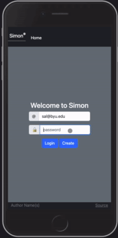

# Start up application

The focus of this course is to help you understand the technologies necessary to launch a web application start up. Towards this goal you will build your very own `start up` application. The actual application you build is entirely up to you, but it must successfully demonstrate the technologies we focus on.

The course is divided into distinct milestones. At each milestone you will evolve your start up application to take on more and more functionality. You start with a conceptual design document and then build a structural shell for the application using HTML. Next comes styling with CSS, interactivity with JavaScript, using third party web services, hosting your own web service, database connectivity for persistent storage, converting to a web framework with React, peer to peer communication with WebSockets, and finally a full mobile application using Progressing Web Application (PWA).

- **HTML** - Basic structural and organizational elements
- **CSS** - Styling and animating
- **JavaScript** - Interactivity _(e.g. What happens when a user presses a button)_
- **Web service** - Remote functions that your application calls on your, or someone else's, web server _(e.g. saveScores, getWeather, chatWithFriend)_
- **Authentication** - Creating accounts and logging in
- **Database persistence** - Storing user data in a database _(e.g. Save the high scores and login information)_
- **Web framework** - Using React to add components and request routing
- **WebSocket** - Support for peer to peer communication. _(e.g. chatting with friends through the browser)_
- **PWA** - Install your application on a mobile phone

The [Simon](https://simon.cs260.click) application is meant to give you an example of the level of complexity you are looking for, and how to build your start up application. Use Simon as a chance to experiment with things you are considering doing with your start up application.

Immediately start thinking about what you would like to build. What you do for your start up application is completely up to you. So make it something that is interesting to you. It doesn't have to be complex. In fact **simple is usually better**. Dream big, but pick a very small minimal viable product for your start up application.

## Deliverables

You will turn in five deliverable versions of your start up application.

1. Design
1. HTML and CSS
1. JavaScript
1. Web service with database support
1. WebSocket and PWA

If you would like, grab a class peer and join forces using pair programming techniques. Your creative energy will help motivate each other when the nights get long.

You can change your project as the class progresses, but each milestone submission must includes all the functionality defined by the previous milestones. For that reason, it is suggested that you do not change your project, and carefully consider your project from the beginning, as the longer you go, the more expensive it will be to repeat your previous work.

## Ideas

Some ideas for possible projects include:

- Simple game like connect four or chess
- Peer chat
- Photo sharing
- Shared story authoring
- Book reviews
- Geo-location sharing
- News sharing
- Favorite website sharing
- Group voting
- Group calendaring
- Fitness tracking

Creativity is usually more important than complexity, and basic implementations of each of the course technologies is sufficient to demonstrate your mastery.

## Examples

The [Simon](https://simon.cs260.click) demonstration application provides a good example for the level of complexity that you should be working towards. Each of the course technologies are demonstrated in about 100 lines of [code](https://github.com/webprogramming260/simon-react#readme).

This realtime [voting application](https://startup.cs260.click) provides another reasonable example.

## Demo day

At the end of class we will conduct a demo day for the best applications. Those selected for the demo day will be awarded additional credit for the exceptional work. The top presenters will be given the coveted Ghirardelli award.

